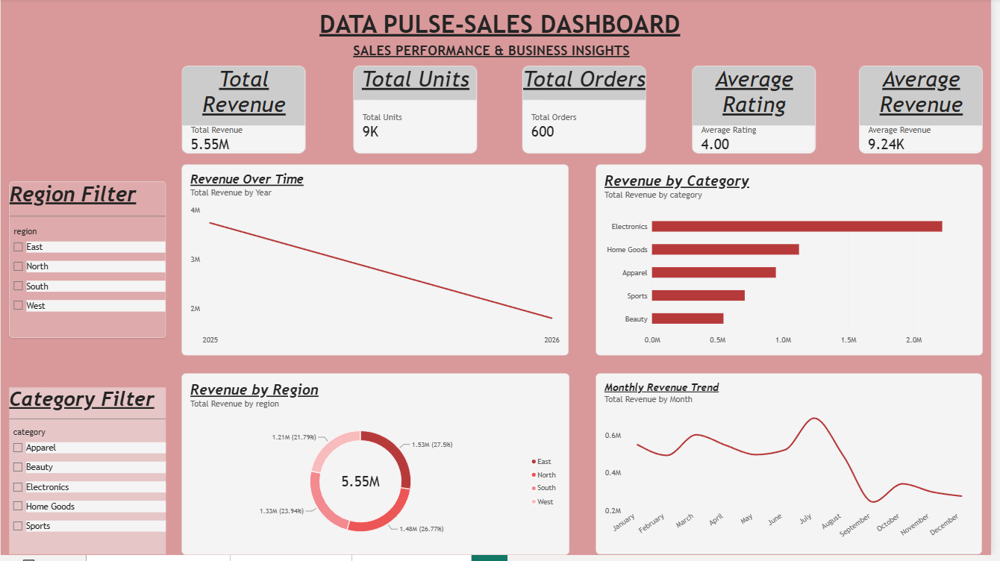
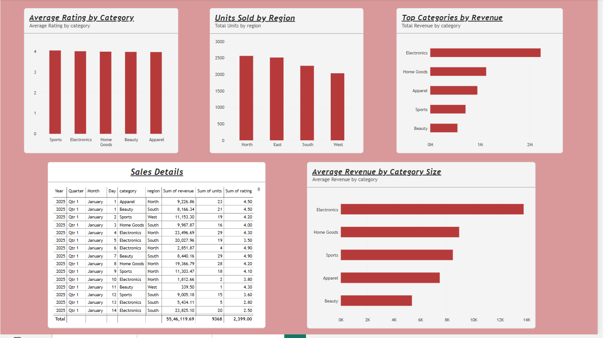
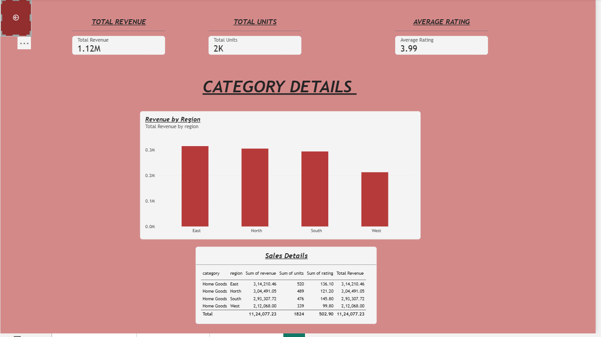

# 📊 DataPulse — Sales Analytics Dashboard

> **Interactive Sales Analytics Dashboard built with Microsoft Power BI**

[](https://www.microsoft.com/en-us/power-platform/products/power-bi)
[](https://learn.microsoft.com/en-us/dax/)
[](https://learn.microsoft.com/en-us/power-query/)

---

## 📌 Project Overview

**DataPulse** is an interactive sales analytics dashboard developed using **Microsoft Power BI**.

The project transforms raw sales data into meaningful business insights by analyzing:

- 💰 Revenue performance
- 📦 Units sold
- 🛒 Total orders
- 🏷️ Product categories
- 🌎 Regional performance
- 📅 Monthly sales trends
- ⭐ Customer ratings

The dashboard contains **3 analytical pages** with interactive filters, KPI cards, detailed tables, and drill-through functionality.

---

## 🎯 Project Objectives

- Monitor overall sales performance.
- Identify high-performing product categories.
- Compare regional revenue performance.
- Analyze revenue trends over time.
- Track customer ratings.
- Identify potential business opportunities.
- Enable interactive data exploration.
- Provide actionable business insights.

---

## 🛠️ Tools & Technologies

| Tool | Purpose |
|---|---|
| **Microsoft Power BI** | Dashboard development and visualization |
| **Power Query** | Data cleaning and transformation |
| **DAX** | Measures and calculations |
| **Data Modeling** | Analytical data structure |
| **Data Visualization** | Business reporting and insights |

---

## 📊 Dashboard Preview

### 1. Executive Dashboard

The Executive Dashboard provides a high-level overview of business performance.



---

### 2. Detailed Analysis

The Detailed Analysis page provides deeper insights into category, regional, and sales performance.



---

### 3. Category Details

The Category Details page provides category-level analysis using drill-through functionality.



---

## 📈 Key Performance Indicators

| KPI | Value |
|---|---:|
| 💰 Total Revenue | $5.55M |
| 📦 Total Units | ~9K |
| 🛒 Total Orders | 600 |
| ⭐ Average Rating | 4.00 / 5 |
| 💵 Average Revenue | $9.24K |

---

## 🔍 Key Business Insights

### 1. Revenue Performance

The dashboard reports approximately **$5.55M in total revenue** across the analyzed sales data.

### 2. Category Performance

**Electronics** is the highest-revenue category, making it an important contributor to overall business revenue.

### 3. Regional Performance

The **East region** generated the highest regional revenue, while the **West region** showed comparatively lower performance.

### 4. Monthly Revenue Trend

Revenue varies considerably throughout the year, with a strong peak around **July** followed by a noticeable decline around **September**.

### 5. Customer Satisfaction

The overall average customer rating is approximately **4.0/5**, indicating generally positive customer satisfaction.

---

## 💡 Business Recommendations

- Prioritize high-performing Electronics products through targeted promotions and inventory planning.
- Investigate the lower revenue performance of the West region.
- Analyze the factors responsible for the July revenue peak.
- Investigate the September revenue decline.
- Continue monitoring customer ratings to maintain customer satisfaction.
- Use regional and category-level insights to improve sales strategies.

---

## ⚙️ Dashboard Features

- 📌 Interactive KPI cards
- 📊 Revenue trend analysis
- 🏷️ Category analysis
- 🌎 Regional analysis
- 📅 Time-based analysis
- 🔎 Interactive slicers
- 📋 Detailed sales tables
- 🔄 Drill-through functionality
- 🔙 Back navigation
- 📈 Dynamic DAX measures

---

## 📄 Dashboard Pages

### Page 1 — Executive Dashboard

Provides a management-level overview of:

- Total Revenue
- Total Units
- Total Orders
- Average Rating
- Average Revenue
- Revenue Over Time
- Revenue by Category
- Revenue by Region
- Monthly Revenue Trend

### Page 2 — Detailed Analysis

Provides detailed analysis of:

- Average Rating by Category
- Units Sold by Region
- Top Categories by Revenue
- Sales Details
- Average Revenue by Category

### Page 3 — Category Details

Provides detailed category-level analysis with:

- Category KPIs
- Revenue by Region
- Sales Details
- Drill-through functionality
- Back navigation

---

## 🔄 Project Workflow

```text
Raw Sales Data
      ↓
Data Inspection
      ↓
Data Cleaning
      ↓
Data Transformation
      ↓
Data Type Validation
      ↓
Data Modeling
      ↓
DAX Measures
      ↓
KPI Development
      ↓
Dashboard Design
      ↓
Interactive Filters
      ↓
Drill-through Analysis
      ↓
Business Insights
      ↓
Business Recommendations


## 👨‍💻 Author

### Arun Kumar Singh

**Aspiring Data Analyst | Business Intelligence Enthusiast**

I am interested in transforming data into meaningful business insights using data analysis and visualization tools.

**Technical Skills**

- SQL
- Python
- Excel
- Power BI
- Power Query
- DAX

**Project:** DataPulse — Sales Analytics Dashboard

🔗 [GitHub Profile](https://github.com/ARUNTHAKURbignner)
